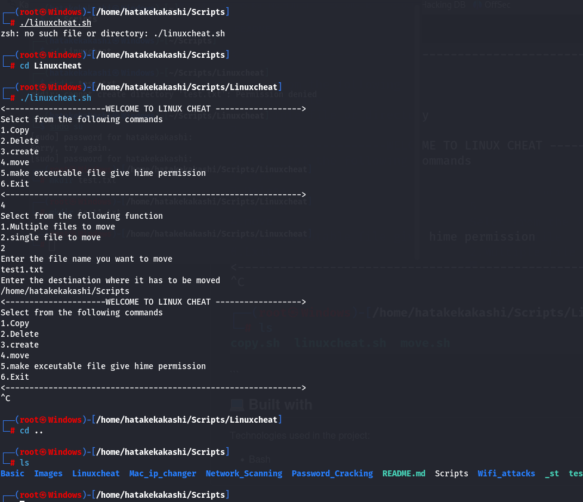

<h1 id="title" align="center">Scripts</h1>

<p id="description">A git repo for basic attack to password cracking tool equipped with wifi attack tool</p>

  
  
<h2>🧐 Features</h2>

Here're some of the project's best features:

*   1.Wifi tools: dos attack tools and deauth tools for wifi attacks
*   2\. For Password cracking of any type from wifi handshake to pdf and zip and brute forcing the services everything covered in it.
*   3\. Nmap scanning tool from basic to service emnueration tools

<h2>🛠️ Installation Steps:</h2>

<p>1. Simple clone the repo and use it.</p>

```
git clone https://github.com/HATAKEkakshi/Scripts.git
```

<p>2.Run chmod +x * then below one .</p>

```
./setup.sh | to install all the required packagees
```

<p>3. Before using wifi attacks use monitor.sh file to make wifi dongle in monitor mode</p>

```
./monitor.sh press 1 to continue
```

<p>4. Device name is wifi dongle name</p>

```
type ifconfig  command on terminal to check wifi dongle name .
```
<h2>Documentation</h2>
  <h3>Basic</h3>
  <p> • It is for basic update and upgrade for debain linux sysstems</p>
  <h3> Linux Cheat</h3>
  <p> • The Idea Behing the Linux cheat is same as the name suggested Basically cheat sheet for new linux user. </p>
  <p><strong>Five Basic Commands</strong></p>
  <ul>
    <li>Create</li>
    <li>Delete</li>
    <li>Executable</li>
    <li>Copy</li>
    <li>Move</li>
  </ul>
    <h3><strong>Copy</strong></h3>
    
    
    <h3><strong>Delete</strong></h3>
    
    
    <h3><strong>Create</strong></h3>
     
    <h3><strong>Move</strong></h3>
      
      
    <h3><strong>Exceutable</strong></h3>
      
      
      
    <h2>Mac_ip_changer</h2>
       
    <h2>Wifi attacks</h2>
      <p>1. Before starting the attack make sure you have your wifi dongle connected.</p>
      <p>2. Now check Wifi dongle name with command </p>

```
ifconfig
```

<p>3. Now Use sudo su for going root and then follow the commands.</p>

```
./monitor.sh and press 1 then enter wifi dongle name
```
<p><strong>MONTOR MODE</strong></p>

<p>1.First run ./flood.sh</p>
  <h3>Capturing Wpa Handshake File</h3>
  <h2>💻 Built with</h2>

Technologies used in the project:

*   Bash
